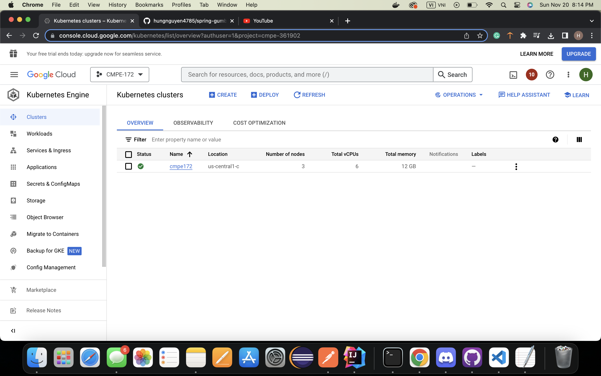
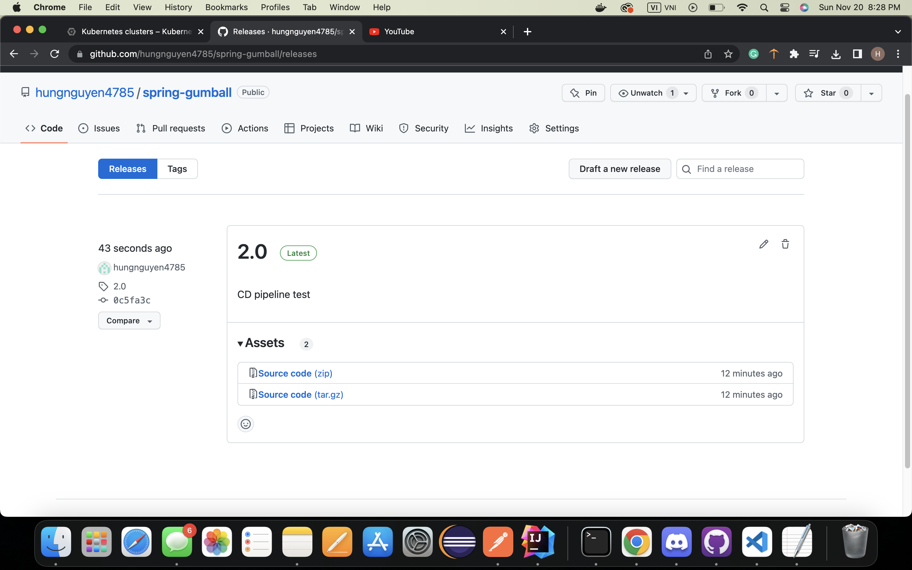
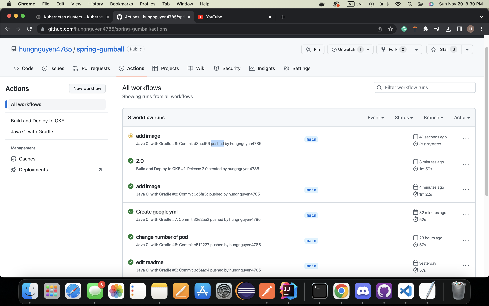
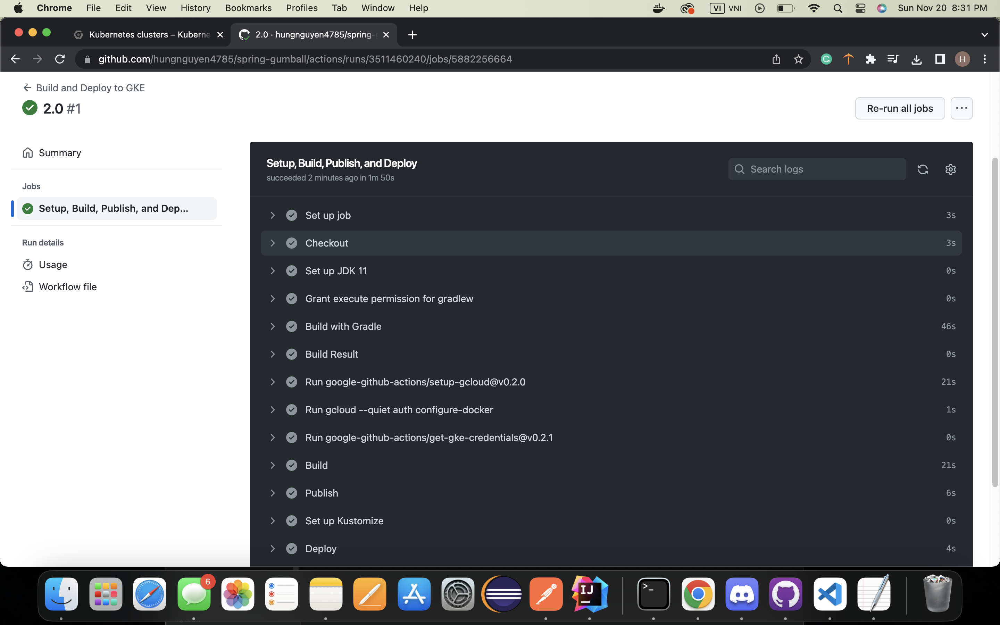
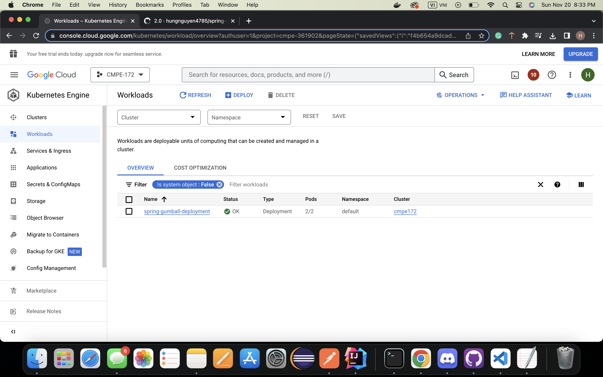
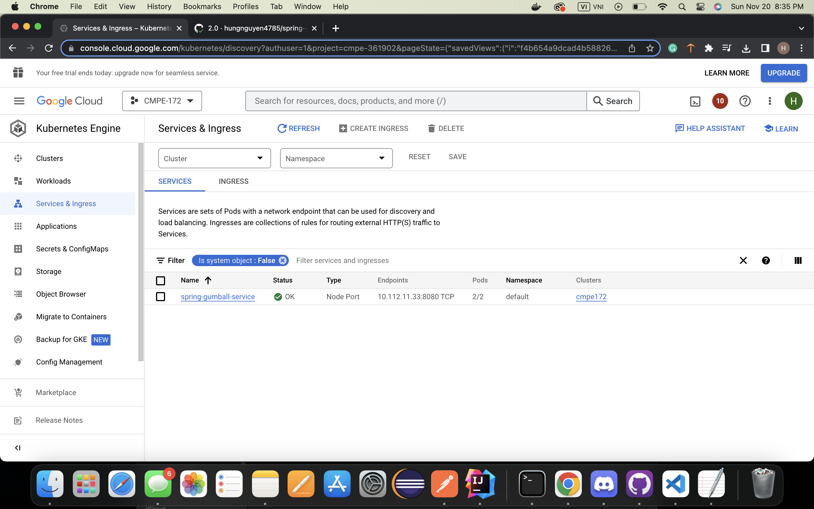
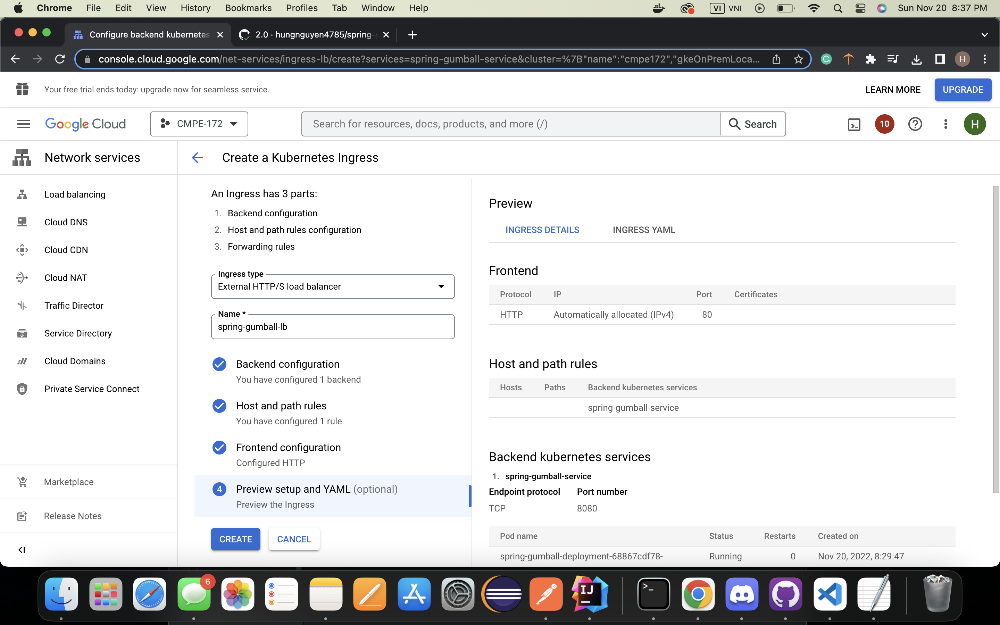
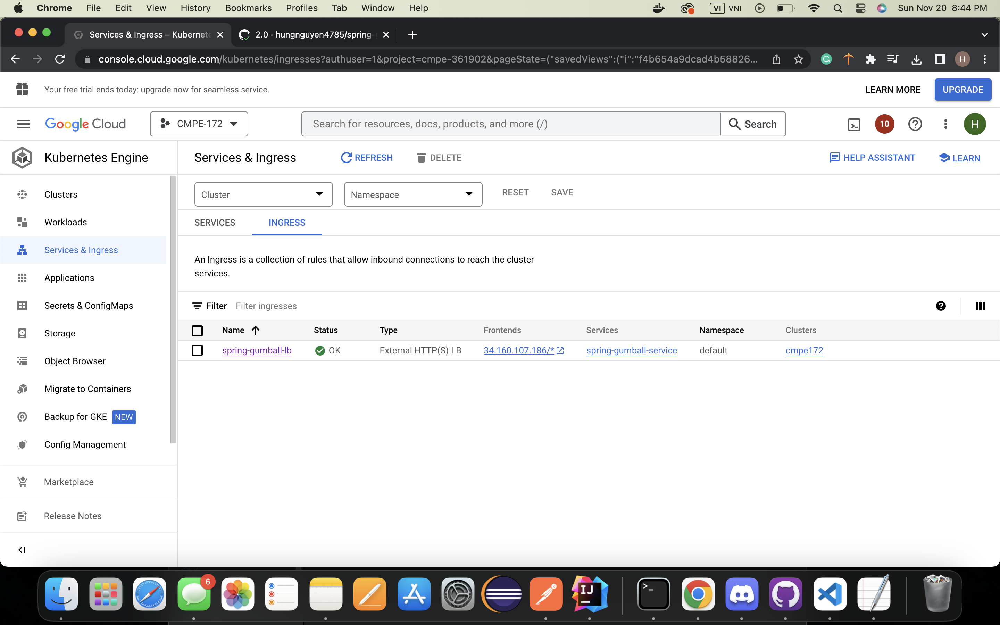
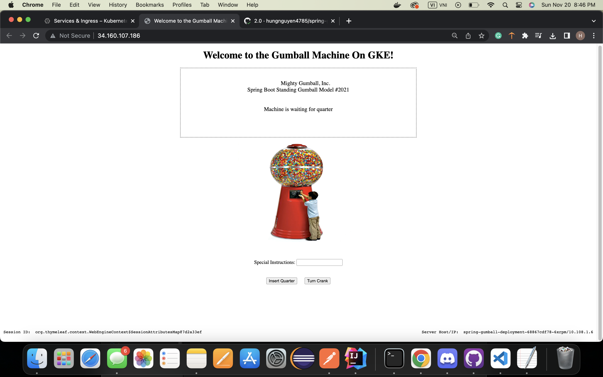

# spring-gumball
## CI Workflow
### Using the Gradle starter workflow
On GitHub, go to Action and click on create new workflow, then find java with gradle to create file gradle.yaml.
Gradle workflow is successfully created and shown in the directory

Images below shown the workflow is created successfully

## CD Workflow
### Deploying to Google Kubernetes Engine
#### Creating a GKE cluster
Go to google console -> Kubernetes Engine -> Cluster to create new cluster.
Configure Standard cluster

Name of the cluster is cmpe172
Zone i sus-central-c

New cluster is creating

#### Enabling the APIs
In Google Cloud Console -> click on APIs & service -> Library -> Private APIS to enable access APIs.

### Set up Secrets in Workspace
Find the Project ID by go to the dashboard 

Project ID is under project info

### Create a Service Account for GitHub Access
Click on Navigation -> IAM & Admin -> Service Accounts to create a new Service Account.
Service account name is spring-gumball

New service account is created

Go to Navigation ->  IAM & Admin -> IAM -> Permissions to grant access 

Enter the principals name

Enter roles

Access is granted

#### Create a JSON service account key Links to an external site.for the service account
Go to Navigation ->  IAM & Admin -> IAM -> Service Account -> Select "spring-gumball" -> Keys -> Create New Key

Select Json

Download Json key file

Json is created

#### Configure GitHub Secrets
On GitHub, go to 

#### Configuring Kustomize

#### Trigger and Deployment to GKE

