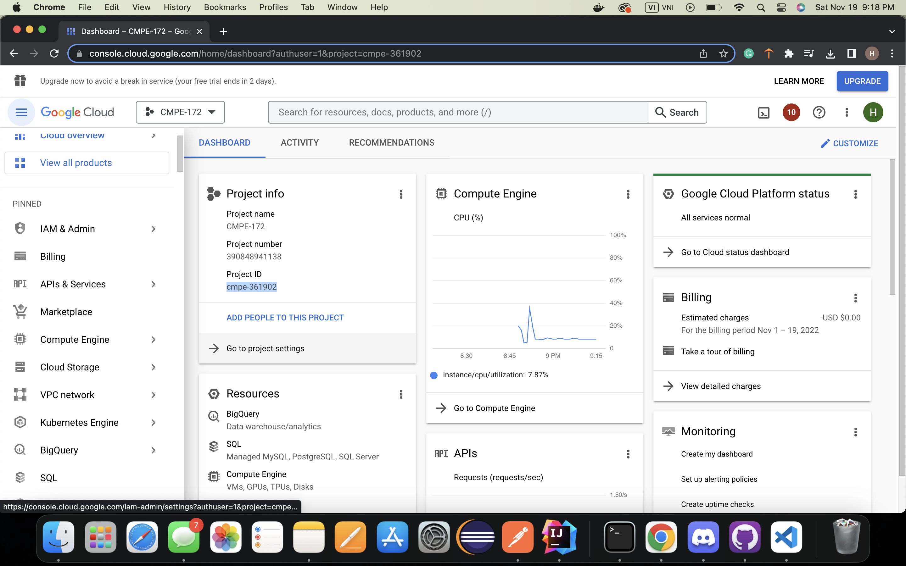

# spring-gumball
## CI Workflow
### Using the Gradle starter workflow

## CD Workflow
### Deploying to Google Kubernetes Engine
#### Creating a GKE cluster

#### Enabling the APIs

### Set up Secrets in Workspace

### Create a Service Account for GitHub Access

#### Create a JSON service account key Links to an external site.for the service account

#### Configure GitHub Secrets

#### Configuring Kustomize

